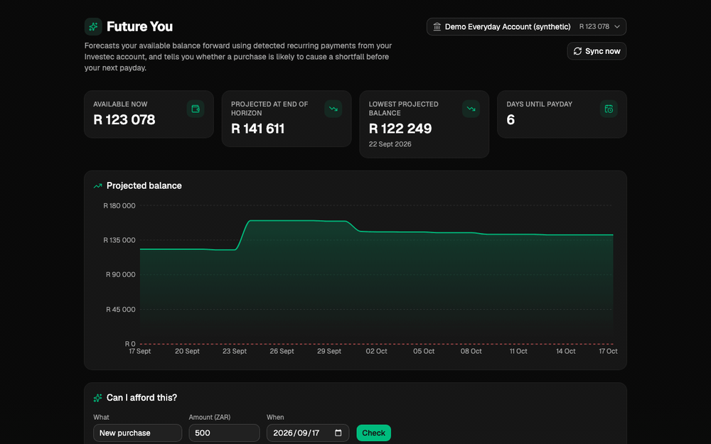
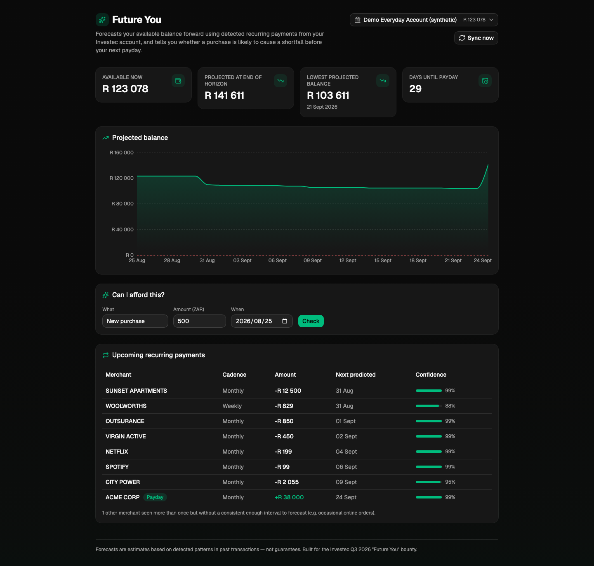
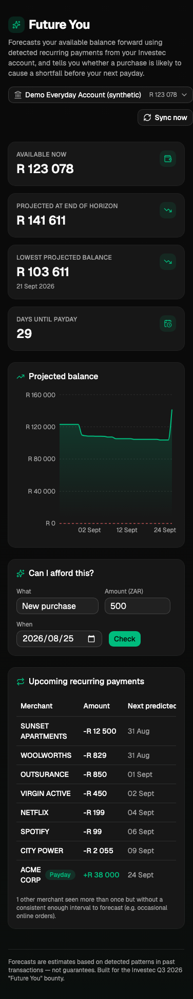
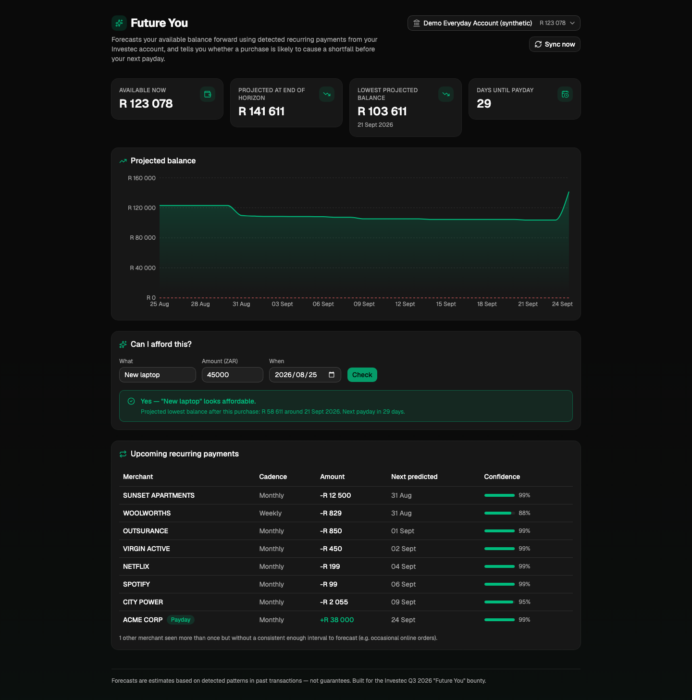
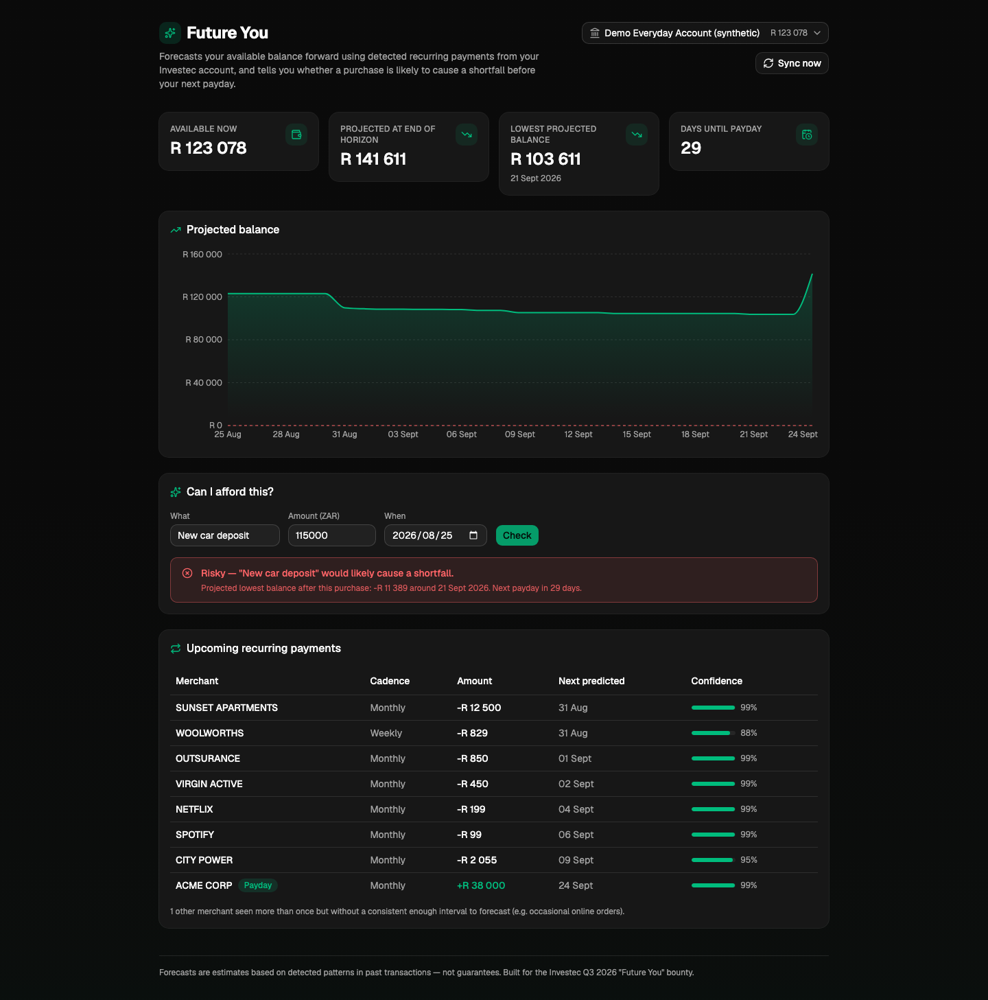

# Future You

> Built for the Investec Developer Community's **Q3 2026 "Future You" Bounty**.
> Most banking apps tell you what happened. This one tells you what's likely to happen next.

**Live demo:** https://investec-future-you.vercel.app

Forecasts your available balance forward, detects recurring payments and
debit orders from your Investec transaction history, flags cashflow risk
before it happens, and answers "can I afford this?" before you spend.

## Demo


| Dashboard | Mobile |
| --- | --- |
|  |  |

**"Can I afford this?"** — same purchase amount, two different balances:
| Affordable | Risky |
| --- | --- |
|  |  |

Re-record the GIF with `scripts/capture-demo.sh`.

## 1. What problem does this solve?

Bank apps are great at showing a list of things that already happened.
They're bad at answering the question people actually care about: *will I
still have money before my next payday if I spend this now?* This app turns
raw Investec transaction history into a forward-looking projection, so a
cashflow squeeze shows up as a warning on a dashboard instead of a declined
card at the till.

## 2. Who is it for?

Anyone who gets paid on a fixed-ish schedule and has a handful of recurring
debit orders (rent, insurance, subscriptions, a home loan) and wants a
plain-English answer to "how much of this is actually mine to spend before
payday?" — the same use case as the bounty's "Starter" and "Intermediate"
tiers (runway calculator, subscription tracker, cashflow risk warnings).

## 3. Which Investec API data does it use?

- **OAuth2 `client_credentials`** — `POST /identity/v2/oauth2/token`
  (`convex/investec/client.ts`)
- **Accounts** — `GET /za/pb/v1/accounts`
- **Transactions** — `GET /za/pb/v1/accounts/:id/transactions?fromDate&toDate`,
  including each transaction's `runningBalance`
- **Balance** — `GET /za/pb/v1/accounts/:id/balance` (current and available).
  The forecast starts from current balance; it falls back to the newest
  `runningBalance` if the endpoint fails
- **Pending** — `GET /za/pb/v1/accounts/:id/pending-transactions`, stored as a
  snapshot and shown as provenance, not folded into the forecast
- **Beneficiaries** — `GET /za/pb/v1/accounts/beneficiaries`, used only to
  relabel `OnlineBankingPayments` with a saved beneficiary name

This app runs against the **Investec Sandbox** (`openapisandbox.investec.com`)
with the publicly-documented sandbox demo credentials — no real account data
is used. A synthetic, deterministically-generated demo account (see
`convex/seed.ts`) is also included so the forecasting logic can be exercised
even without any Investec credentials at all. The header strip shows which
source the numbers came from (sandbox, synthetic, or a failed sync).

## 4. How does it detect recurring payments and forecast future balances?

Detection (`convex/recurring/detect.ts`):

1. Group transactions by a normalised merchant name (strip trailing order
   numbers, uppercase, etc. — reused logic from an earlier Investec project)
   and by debit/credit direction.
2. Require at least 2 occurrences of the same merchant/direction.
3. Compute the median number of days between occurrences and classify the
   cadence as `weekly` (~7d), `biweekly` (~14d), `monthly` (~28-31d, aligned
   to day-of-month rather than a fixed day count so it survives different
   month lengths), or `irregular` if the interval doesn't fit any bucket.
4. Score a **confidence** (0-1) from three factors: how many times it's been
   seen, how consistent the interval is, and how consistent the amount is
   (a variable electricity bill still counts as monthly, just with lower
   confidence than a fixed rent payment).
5. Prefer Investec's own `transactionType` (`DebitOrders`, `FeesAndInterest`,
   `Deposits`, …) over a description guess when it is present.
6. Flag amount spikes, drops, and missed expected payments as anomalies.
7. The largest-amount **monthly credit** series is flagged as payday.

Those series feed a proactive insights panel (cashflow risk, spikes, missed
debit orders). Full rules: [docs/detection-insights.md](docs/detection-insights.md).

Forecasting (`convex/forecast/engine.ts`, methodology in
[docs/forecast-methodology.md](docs/forecast-methodology.md)):

1. Start from the current balance (balance endpoint when the sync has it,
   otherwise the newest `runningBalance`).
2. Walk forward day-by-day for 30/60/90 days, projecting each non-irregular
   recurring series (monthly series step by calendar month so a "28th of the
   month" bill stays on the 28th).
3. Optionally drain a variable-spend baseline (median daily debit over the
   last 8 weeks, excluding detected recurring merchants).
4. Record the expected line plus optimistic and pessimistic bands, the first
   date the expected line would touch a configurable safety buffer, **safe to
   spend** before the next payday, and **runway** in days.

"Can I afford this?" reruns the same projection with one extra hypothetical
debit and compares the projected minimum with and without it. The scenario
planner does the same for paused series and one-off what-ifs — projections
only, never a real payment.

Spend is also bucketed by a rule-based categoriser (merchant keywords, MCC,
transaction type) into a "where your money goes" breakdown. Sync recomputes
categories after every pull.

## 5. What assumptions does it make?

- Recurring amounts and dates are assumed to repeat going forward exactly as
  detected historically — no seasonality, raises, or once-off changes are
  modelled.
- A merchant needs **2+ occurrences** in the synced history to be considered
  recurring at all; a first-ever debit order won't show up until it repeats.
- Monthly cadence is inferred from a 24-34 day gap between occurrences, which
  can occasionally misclassify a payment that's a few days early/late in a
  given month.
- Pending transactions are fetched and shown, but they are **not** subtracted
  from the forecast — the sandbox pending endpoint is unreliable, and mixing
  an unposted hold into a posted-balance projection double-counts.
- Confidence scores are a heuristic, not a statistical guarantee — they're
  meant to help a user judge how much to trust a given prediction, not to be
  read as a precise probability.

## 6. How can someone install and run it?

Requirements: Node.js 18+, a free [Convex](https://www.convex.dev) account.

```bash
npm install
npx convex dev   # first run: log in via browser, creates a Convex project
```

In a second terminal:

```bash
npm run dev      # Vite dev server on http://localhost:5173
```

The Investec **sandbox** credentials are already public (see
[.env.example](./.env.example) and the community's
[Investec sandbox docs](https://investec.gitbook.io/programmable-banking-community-wiki/get-started/api-quick-start-guide/how-to-authenticate));
set them on your Convex deployment once:

```bash
npx convex env set INVESTEC_BASE_URL "https://openapisandbox.investec.com"
npx convex env set INVESTEC_CLIENT_ID "yAxzQRFX97vOcyQAwluEU6H6ePxMA5eY"
npx convex env set INVESTEC_CLIENT_SECRET "4dY0PjEYqoBrZ99r"
npx convex env set INVESTEC_API_KEY "eUF4elFSRlg5N3ZPY3lRQXdsdUVVNkg2ZVB4TUE1ZVk6YVc1MlpYTjBaV010ZW1FdGNHSXRZV05qYjNWdWRITXRjMkZ1WkdKdmVBPT0="
```

Then either click **"Sync now"** in the app, or seed synthetic demo data
instead/as well:

```bash
npx convex run seed:seedDemoAccount '{}'
```

A cron job (`convex/crons.ts`) also re-syncs every 4 hours automatically.

## 7. What does it not do?

- No payment initiation, transfers, or programmable card rules — read-only.
- No production-grade auth/multi-tenancy — this is a single-deployment demo
  covering whichever accounts the configured Investec credentials expose.
- No machine-learning model for detection or forecasting — both are
  deterministic, explainable heuristics, so every number on the dashboard can
  be traced back to a rule in this README or `docs/forecast-methodology.md`.
- No financial advice: the affordability calculator and the chat both show a
  projection based on stated assumptions, not a guarantee, and say so in the UI.
- **Chat with Future You** (`convex/chat/`) is an optional OpenAI tool-calling
  layer. The model can only call the same deterministic forecast, recurring,
  insight, and category queries the dashboard uses — it never invents a
  balance, and it cannot move money. It stays off unless `OPENAI_API_KEY` is
  set on the Convex deployment. Tool calls are shown in the UI.

## Tech stack

- **Backend:** [Convex](https://www.convex.dev) — database, scheduled
  functions (cron sync), and server functions (queries/mutations/actions),
  all in TypeScript
- **Frontend:** React 19 + Vite + Tailwind CSS v4 + shadcn/ui + Recharts + Motion
- **Tests:** Vitest + convex-test. CI on GitHub Actions (typecheck, lint, test, build)

## Project layout

```
convex/
  schema.ts               -- accounts, transactions, recurringSeries, insights, chat, syncRuns
  investec/               -- OAuth client, balance/pending/beneficiaries, sync pipeline
  recurring/detect.ts     -- recurring payment/income detection + anomalies
  insights/               -- proactive cashflow insights derived from series
  forecast/               -- pure projection engine + queries
  categorisation/         -- rule-based spend categories
  chat/                   -- optional AI coach (tool-calling over the queries above)
  seed.ts                 -- synthetic demo data generator
  crons.ts                -- periodic Investec sync
src/components/           -- dashboard UI
docs/                     -- methodology, architecture, screenshots, demo GIF
```

Deeper map: [docs/architecture.md](docs/architecture.md).
Contributing and security notes: [CONTRIBUTING.md](CONTRIBUTING.md), [SECURITY.md](SECURITY.md).

## License

[MIT](./LICENSE)
