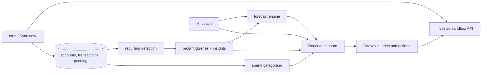

# Architecture

Future You is a read-only cashflow forecast on top of the Investec Programmable Banking sandbox.

## Data flow

1. `convex/investec/sync.ts` pulls accounts, transactions, balance, pending transactions, and beneficiaries. Tokens are cached in `investecToken`. A sync run row records success or failure.
2. After each account upsert, `recurring.detect.recompute` rebuilds series and insights in the same pipeline, then `categorisation.recomputeForAccount` writes `transactions.category`.
3. `forecast/engine.ts` is a pure function. Queries in `forecast/queries.ts` load the account and series and call it. The UI never computes balances itself.
4. `chat/coach.ts` is optional. If `OPENAI_API_KEY` is set, the model may call the same queries via tools in `chat/tools.ts`. It cannot write payments or invent figures the tools did not return.

## What is deterministic

Detection, categorisation, insights, and the forecast are rules with tests under `convex/**/*.test.ts`. The chat is the only non-deterministic step, and it is gated and tool-bound.

## CI notes

`npm run typecheck` starts with `npx convex codegen`, which needs a live deployment. CI (`.github/workflows/ci.yml`) typechecks the committed `convex/_generated` with `tsc` instead, then runs lint, `npm test`, and `npm run build`. An optional job regenerates codegen when `CONVEX_DEPLOY_KEY` is set and fails if the committed files drift.
